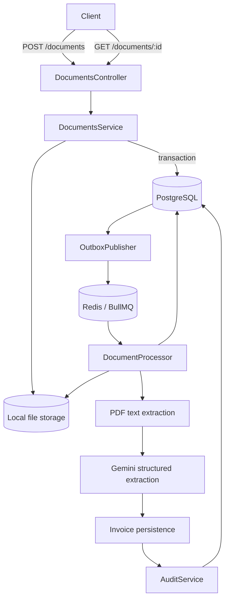

# Architecture

Finance Audit Engine is a NestJS service that accepts invoice documents, extracts structured invoice data with Gemini, evaluates deterministic audit rules, and exposes the complete result through a polling endpoint.

## Components

| Area               | Responsibility                                                                              |
| ------------------ | ------------------------------------------------------------------------------------------- |
| `DocumentsModule`  | Upload validation, deduplication, metadata persistence, result retrieval, and BullMQ worker |
| `StorageModule`    | Abstract storage contract and local filesystem implementation                               |
| `OutboxModule`     | Publishes committed database events to Redis/BullMQ                                         |
| `ExtractionModule` | Extracts text from PDF buffers                                                              |
| `AiModule`         | Maps the abstract invoice AI provider to Gemini                                             |
| `InvoicesModule`   | Upserts invoices and atomically replaces line items                                         |
| `AuditModule`      | Runs deterministic financial checks and persists findings                                   |
| `PrismaModule`     | Provides the Prisma 7 PostgreSQL client and driver adapter                                  |
| `QueueModule`      | Configures the shared Redis connection for BullMQ                                           |

Infrastructure modules and domain services are global where they need to be shared by the document worker.

## Processing flow



### Upload and outbox transaction

1. The API accepts a multipart field named `file` with a 10 MB limit.
2. `DocumentsService` validates the MIME type and calculates a SHA-256 hash.
3. If the hash already exists, the existing document is returned and no new job is created.
4. A new file is saved under `storage/documents` using a UUID filename.
5. A database transaction creates the `Document` and its `OutboxEvent` together.
6. If database persistence fails after the file was written, the file is deleted as compensation.

### Outbox publication

`OutboxPublisher` polls every three seconds for up to ten `PENDING` events. Each event becomes a BullMQ job with:

- Queue: `document-processing`
- Job name: `process-document`
- Job ID: the outbox event ID, providing queue-level deduplication
- Attempts: 5
- Backoff: exponential, starting at 1 second

After enqueueing, the event becomes `PUBLISHED` and the document becomes `QUEUED`. Failed publication leaves the event pending and increments its attempt counter so a later poll can retry it.

### Worker pipeline

The worker performs these steps:

1. Load the document and skip it when already `APPROVED` or `NEEDS_REVIEW`.
2. Change the document to `EXTRACTING`.
3. Read the file from local storage.
4. Extract PDF text and upsert the `Extraction` record.
5. Ask Gemini for structured JSON and validate it with Zod.
6. Upsert the `Invoice` and atomically replace all line items.
7. Change the document to `AUDITING`.
8. Run the deterministic audit and replace its findings transactionally.
9. Set the document to `APPROVED` when the audit passes, otherwise `NEEDS_REVIEW`.

## Failure behavior

Gemini failures are classified before they reach BullMQ:

| Failure                                 | Classification | Worker behavior  |
| --------------------------------------- | -------------- | ---------------- |
| Empty Gemini response                   | Retryable      | BullMQ retries   |
| HTTP 408 or 429                         | Retryable      | BullMQ retries   |
| HTTP 5xx                                | Retryable      | BullMQ retries   |
| Unknown provider failure                | Retryable      | BullMQ retries   |
| Invalid JSON or invalid response schema | Permanent      | Retry is aborted |
| HTTP 400, 401, 403, or 404              | Permanent      | Retry is aborted |

On each failed attempt, the worker stores the error message. After the last attempt, or immediately for an unrecoverable error, the document becomes `EXTRACTION_FAILED`.

## Document lifecycle

```text
UPLOADED -> QUEUED -> EXTRACTING -> AUDITING -> APPROVED
                                           -> NEEDS_REVIEW
                       failure/retry limit -> EXTRACTION_FAILED
```

`EXTRACTED` and `AUDIT_FAILED` exist in the schema but are not currently assigned by the worker.

## Current boundaries

- Local files and PostgreSQL are not committed atomically; cleanup compensates for a database failure after file creation.
- The upload API accepts PDF, JPEG, and PNG MIME types, but the current worker always uses the PDF parser. End-to-end processing is therefore currently reliable only for text-based PDFs; OCR is not wired yet.
- Processing runs in the same Nest process as the HTTP API. It can later be split into a dedicated worker process without changing the queue contract.
- There is no authentication or authorization layer yet.
