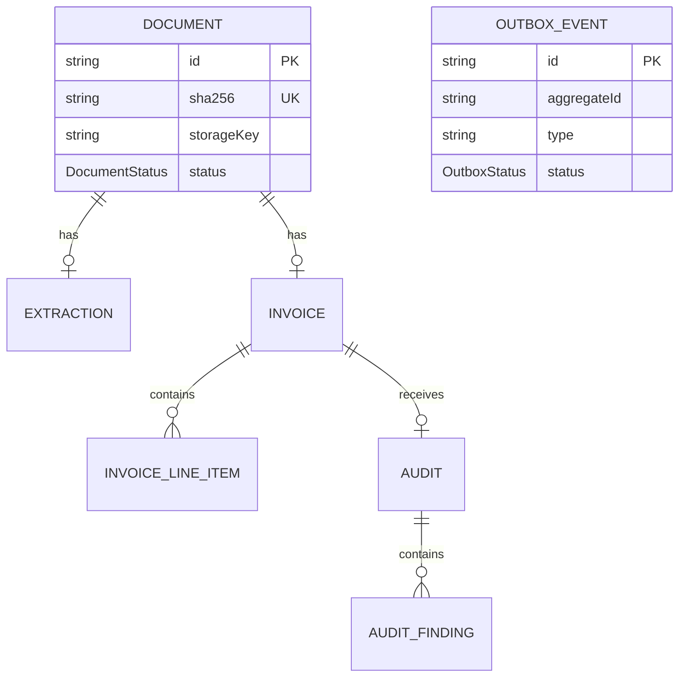

# Data Model

PostgreSQL is accessed through Prisma ORM 7 with the `@prisma/adapter-pg` driver adapter. The source schema is `prisma/schema.prisma` and migrations live under `prisma/migrations`.

## Relationships

`OutboxEvent.aggregateId` points to the owning document by convention, but it is intentionally not declared as a database foreign key.

## Models

### Document

The root processing entity. It stores original file metadata, the content hash used for deduplication, the local storage key, current workflow status, and the latest error message.

Important constraints:

- `sha256` is unique.
- `storageKey` is nullable to support records without a stored file, although the worker requires it.
- Deleting a document cascades to its extraction and invoice through their relations.

### OutboxEvent

Represents work that must be published to BullMQ after the document transaction commits.

- New events default to `PENDING`.
- Successful publication records `PUBLISHED` and `publishedAt`.
- Publication errors increment `attempts` and update `lastError`.

The `FAILED` status exists but the current publisher does not assign it or impose a maximum publication-attempt count.

### Extraction

One-to-one with `Document`, enforced by unique `documentId`. It stores the extraction method, full raw text, and character count. The worker currently writes `PDF_TEXT`; `OCR` is reserved for future image extraction.

### Invoice

One-to-one with `Document`, enforced by unique `documentId`. Nullable fields reflect values that may be missing from the source invoice. Money uses PostgreSQL/Prisma `Decimal` values.

Reprocessing uses an upsert, so the invoice identity remains stable while extracted scalar values are refreshed.

### InvoiceLineItem

Many-to-one with `Invoice`. Reprocessing deletes all existing line items and recreates them inside the same transaction as the invoice upsert.

### Audit

One-to-one with `Invoice`, enforced by unique `invoiceId`. Its final status is currently either `PASSED` or `NEEDS_REVIEW` in the active audit flow.

### AuditFinding

Many-to-one with `Audit`. Findings are replaced on every audit run in the same transaction as the audit upsert.

## Audit rules

Every current finding has severity `ERROR`. Any error changes the audit to `NEEDS_REVIEW`; no findings results in `PASSED`.

| Finding type             | Trigger                                                   |
| ------------------------ | --------------------------------------------------------- |
| `MISSING_VENDOR`         | `vendorName` is absent                                    |
| `MISSING_INVOICE_NUMBER` | `invoiceNumber` is absent                                 |
| `LINE_TOTAL_MISMATCH`    | Quantity multiplied by unit price differs from line total |
| `SUBTOTAL_MISMATCH`      | Sum of non-null line totals differs from invoice subtotal |
| `TOTAL_MISMATCH`         | Subtotal plus tax differs from invoice total              |
| `DUPLICATE_INVOICE`      | Another invoice has the same vendor and invoice number    |

Calculations use `Prisma.Decimal` operations to avoid floating-point arithmetic errors.

## Cascades

The following relations use `onDelete: Cascade`:

- Document -> Extraction
- Document -> Invoice
- Invoice -> InvoiceLineItem
- Invoice -> Audit
- Audit -> AuditFinding

Deleting a document therefore removes all extraction, invoice, line-item, audit, and finding records associated through these relations. Local files and outbox events are not deleted automatically by these database cascades.
